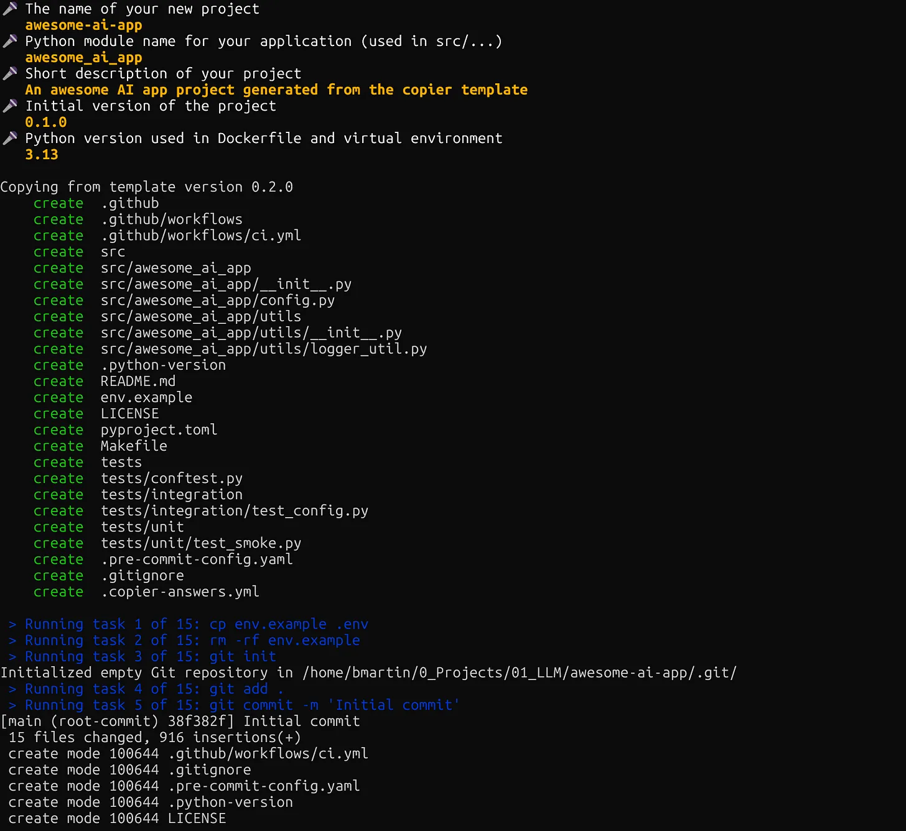

# Copier Python Template

A modern Python project template using Copier, uv, and best-practice tooling.



## Features

- **Modern Python tooling** - uv for dependency management, prek for fast pre-commit hooks
- **Quality checks** - Ruff formatting and linting, mypy type checking, pytest testing
- **Template updates** - Use `copier update` to sync improvements across all your projects
- **GitHub automation** - Automatic repo creation and initial setup
- **Consistent structure** - Same layout across all projects

## Quick Start

Install Copier:

```bash
uv tool install copier
```

Generate a new project:

```bash
copier copy ~/path/to/copier-template-base ~/path/to/new-repo --trust
```

Answer the prompts and your project is ready!

## What Gets Generated

```text
my-project/
.
├── .github
│   └── workflows
│       └── ci.yml
├── LICENSE
├── Makefile
└── README.md           # Only for Copier repository
├── README.md.jinja     # This will generate the new README 
├── copier.yml
├── env.example
├── pyproject.toml.jinja
├── src
│   └── {{ module_name }}
│       ├── __init__.py
│       ├── config.py
│       └── utils
│           ├── __init__.py
│           └── logger_util.py
└── tests
    ├── conftest.py
    ├── integration
    │   └── test_config.py.jinja
    └── unit
        └── test_smoke.py
```

## Updating Projects

When the template improves, update your projects:

```bash
cd my-project
copier update --trust --skip-tasks
```

Review the changes and commit.

## Template Configuration

The template asks for:

- **Project name** - Repository and display name
- **Module name** - Python package name (auto-derived)
- **Description** - One-line project description
- **Python version** - 3.12, 3.13, or 3.14

## Requirements

- Git
- GitHub CLI (`gh`) for automatic repo creation
- uv (installed automatically if missing)
- copier tool

## Learn More

Read the full article: [Template Once, Update Everywhere: Build Evolving Python Templates with Copier](https://aiechoes.substack.com/p/template-once-update-everywhere-build)

## Note

If you clone this repository, make sure to delete the `README.md` file and keep the `README.md.jinja` file. The `README.md` is only for this Copier template repository itself, while `README.md.jinja` is the template that will generate the README for new projects.

Also make sure you remove the `static` folder as it contains the image for the `README.md`
